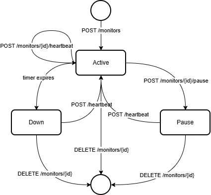

# Pulse-Check-API ("Watchdog" Sentinel)

This challenge is designed to test your ability to bridge Computer Science fundamentals with Modern Backend Engineering.

## 1. Architecture Diagram



## 2. Setup Instruction

### Prerequisites

- [Node.js](https://nodejs.org/) v18 or later (v22+ recommended)
- npm (bundled with Node.js)
- [git](https://git-scm.com/)

### Installation

1. Clone the repository and move into the project directory:

   ```bash
   git clone https://github.com/MrRyt247/Pulse-Check-API.git
   cd Pulse-Check-API
   ```

2. Install dependencies:

   ```bash
   npm install
   ```

### Running the project

Start the development server:

```bash
npm run dev
```

The server starts on [http://localhost:3000](http://localhost:3000) by default.

## 3. API Documentation

